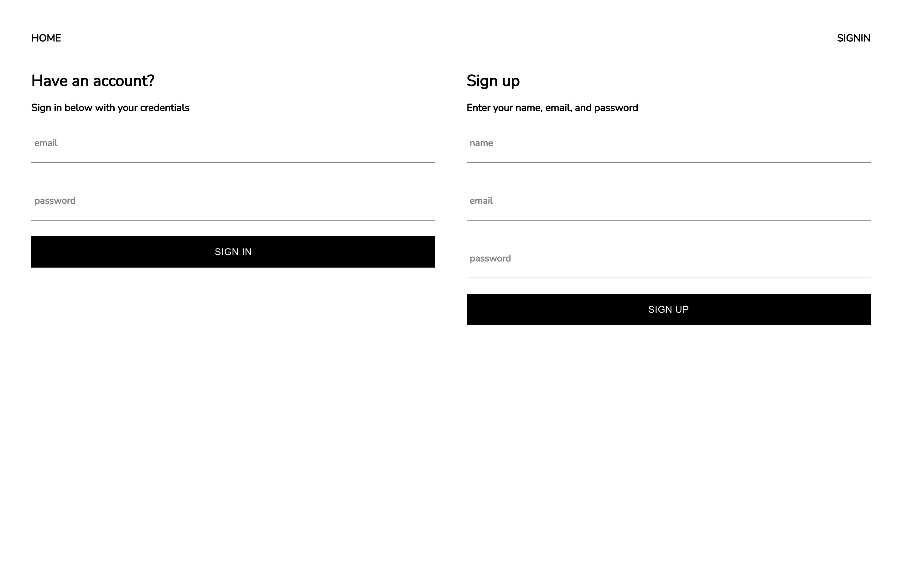
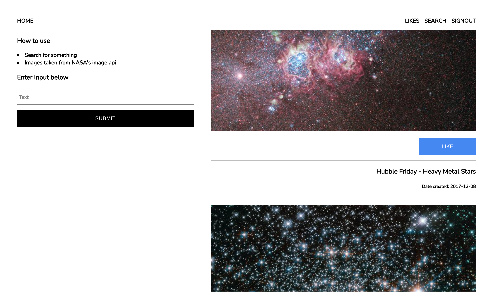
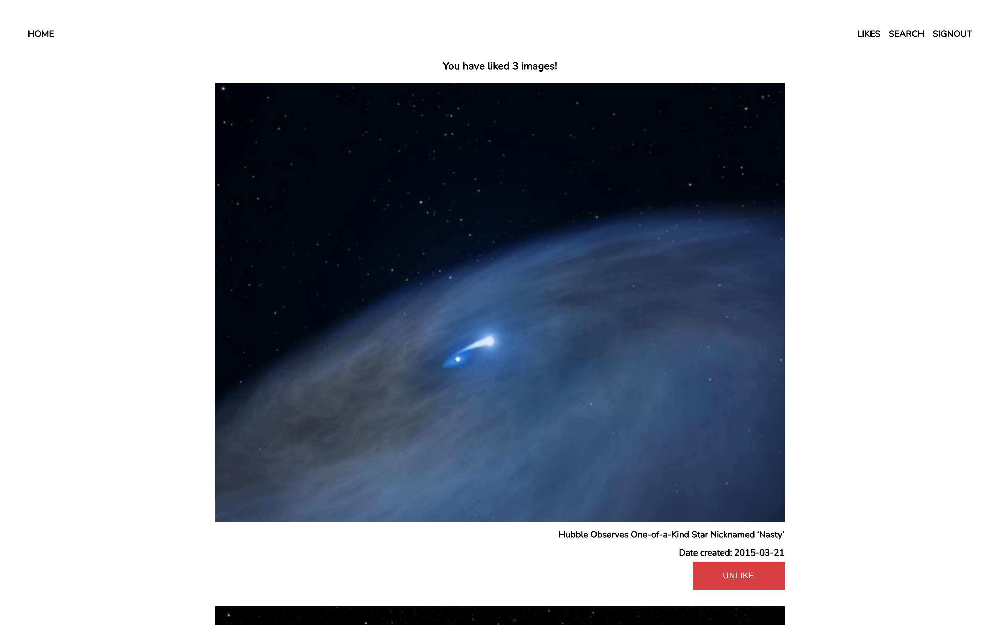

## Intro

Here are screenshots of the project

## Home

## SignIn/SignUp

## Search

## Liked Images

## Code improvements

-   Refactor to use the latest version of firebase
-   Refactor to use hooks and react context instead of redux for statemanagment
-   There is some inconsistency with my redux design patterns used. For next time, maintain a consistent design pattern throughout the applciation
-   Used redux's `createSlice` for state management instead. Makes it easier to track network requests
-   Array filtering is done in linear time, this is not optimal. Next time, use a map instead of an array

## Bugs

-   `useFirestoreConnect` hook doesn't synz front end application state with backend data sometimes. It's rare but to improve this I could manually fetch data if the `useFirestoreConnect` fails
-   Some pages are not optimized for mobile, could polish the scss
-   The google sign in was causing a state management bug on sign in so I removed this feature. In order to fix this I needed to implement a google cloud function. Unfortunaly cloud functions cost money so I did not do this
-   If a user logs in and then another user logs in later, the first user's search results will persist in memory. To fix: update user state on a sign in

## Feature improvements

-   Add password reset functionality
-   Implement a grid view for liked images
-   Implement google sign in
-   use MongoDB instead of Firebase
-   Animate the like button
-   Add transitions between pages
