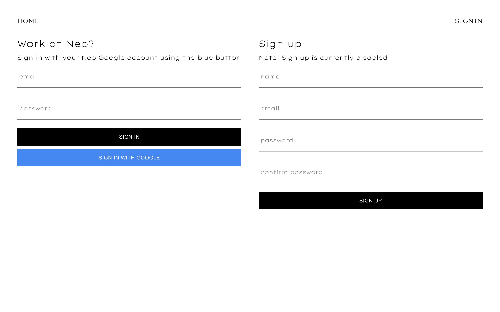
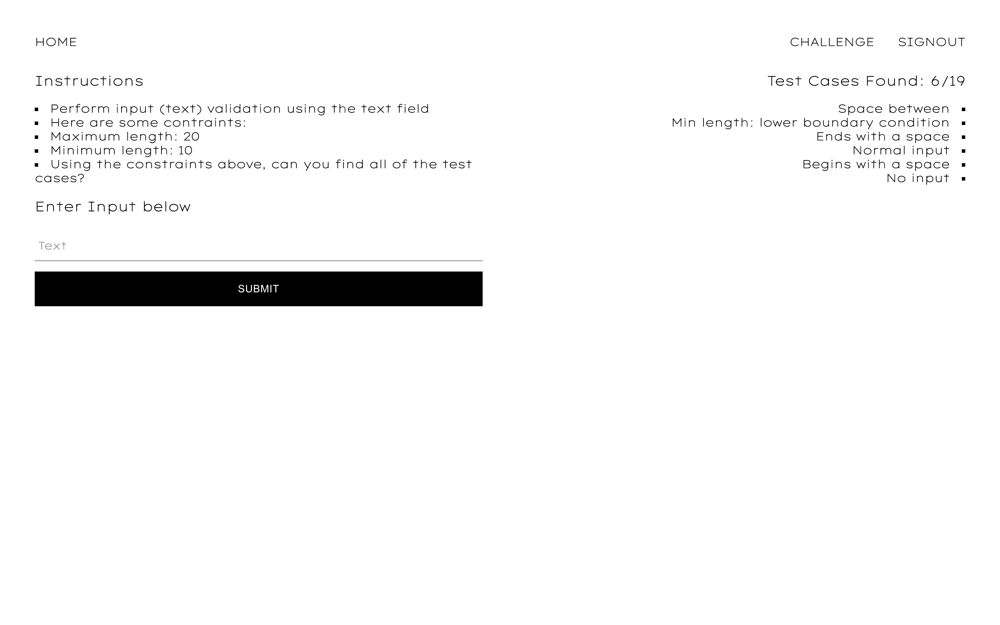

## Work in progress

Here are screenshots of the project:

## Home

## SignIn/SignUp

## Challenge

## Project Takeaways

-   **Problem**: Deploying with firebase failed. **Solution**: Run `npm run build`. Then run `firebase init` and ensure that firebase knows that the `build` folder is the folder that needs to get deployed. Also, do not overwrite the `index.html` file when configuring firebase
-   **Problem**: Syncing the frontend with backend data. I tried to solve this manually but it was a pain to do. **Solution**: Use the `react-redux-firebase` library to automatically sync frontend state with backend data
-   **Problem**: Firebase cannot export data into a `.json` or `.csv` file. **Solution**: Create a custom firebase `http` trigger cloud function that does this
-   **Problem**: Visiting an authenticated route sometimes triggers and infinite re-render and crashes the app. **Solution**: Automatically sign out the user when they close their browser/tab (not an optimal solution but it works)
-   **Problem**: Cloud functions cost money. **Solution**: Run validation logic client side. **Resulting Tradeoff**: This decreases costs but results in a less secure app. Due to the nature of the project this was deemed to be an acceptable risk
